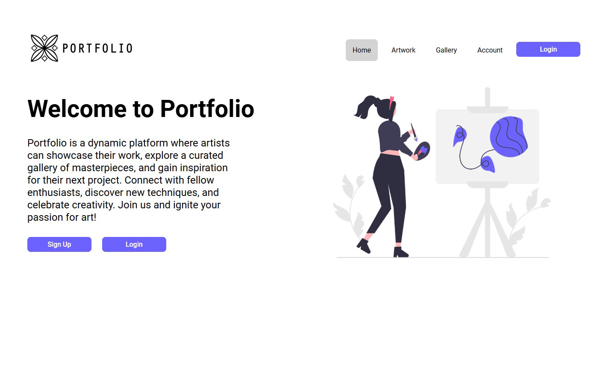
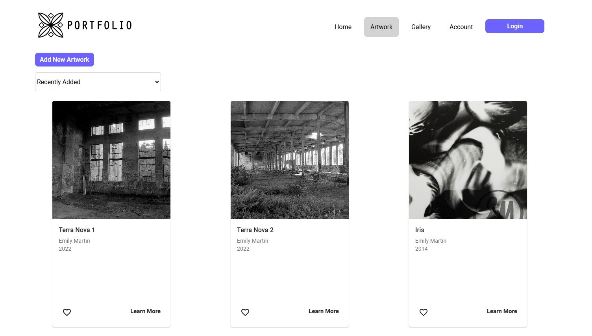
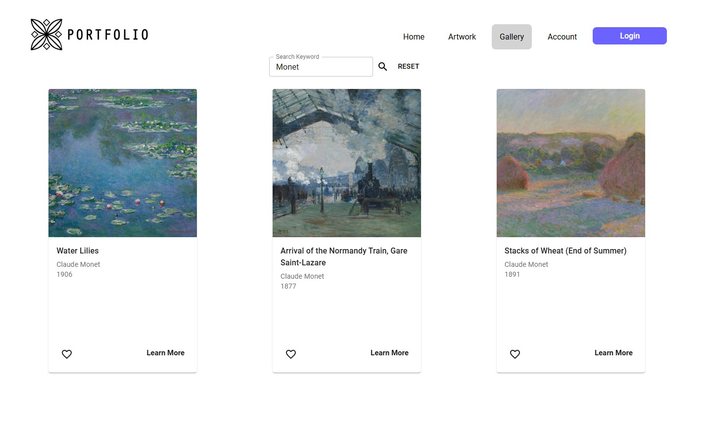
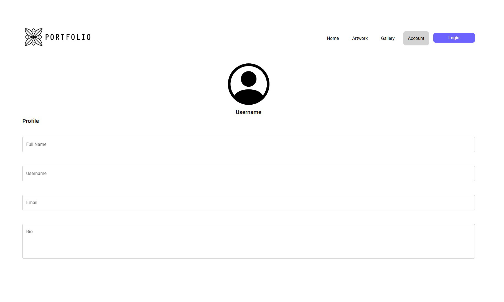

## View Here

https://emilyamartin.github.io/art-inventory/

## Project Overview

Portfolio is a website I developed to help artists and creators catalog their work while also offering inspiration from other artists. The platform features several key pages:
 
 
Artwork Page: Allows users to organize and catalog their own artworks.
 
 
Gallery Page: Users can browse and save artworks from the Art Institute of Chicago, utilizing their open API.
 
 
Accounts Page: Enables users to create and manage personal profiles and accounts.
 
 
In Module 3, I will be focusing on developing the sign-up, login, and artwork upload features. Additionally, I plan to introduce a new page that allows users to upload project ideas. This feature will enable users to upload color palettes, images, sketches, and notes to inspire future projects.

## Motivation

This project was inspired by my personal need for a platform to catalog my own artworks. I wanted to create a space where I, as well as other creators, could easily document their artworks, search for inspiration and brainstorm ideas all in one unified platform.

## Key Features

Search for inspiration using the Art Institute of Chicago's API.
 
Create an account and catalog personal artwork (coming soon).
 
Use the new project feature to brainstorm art projects (coming soon).

## Technology Stack

Layout: Figma
 
Frontend: React JS
 
Component Library: MUI
 
API: Art Institute of Chicago

## Credits

My coach, Lucas Hillier, has been an incredible source of support and guidance throughout the development of this project. His insightful suggestions were crucial in transforming my idea into reality. This project would not have been possible without him and I am truly grateful for all his help.

## Preview

