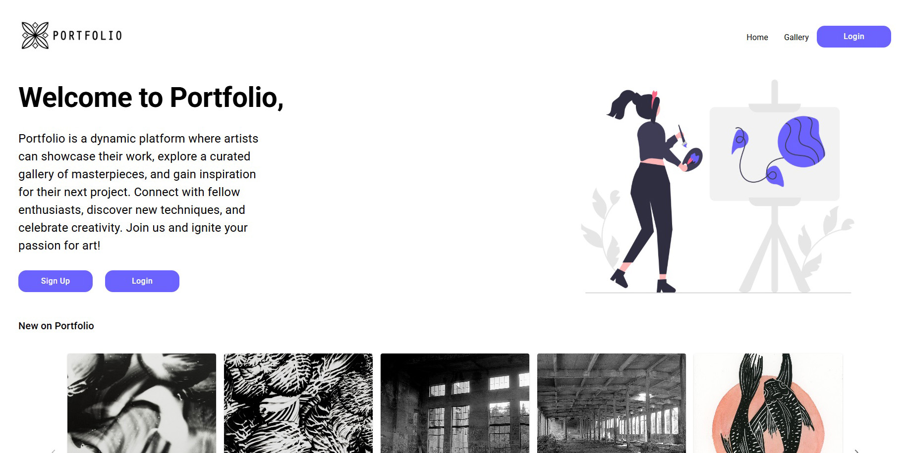
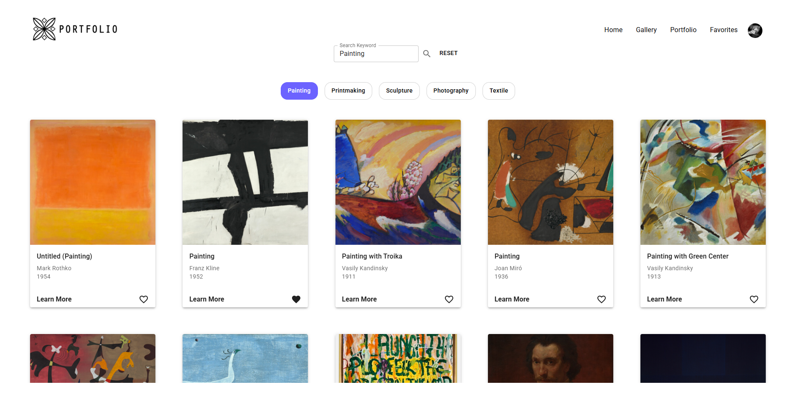
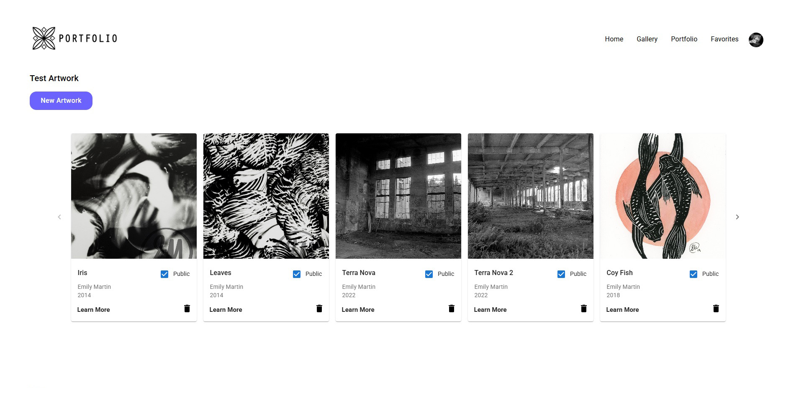
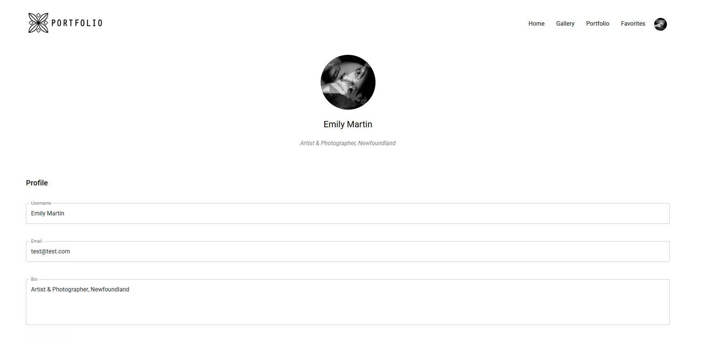
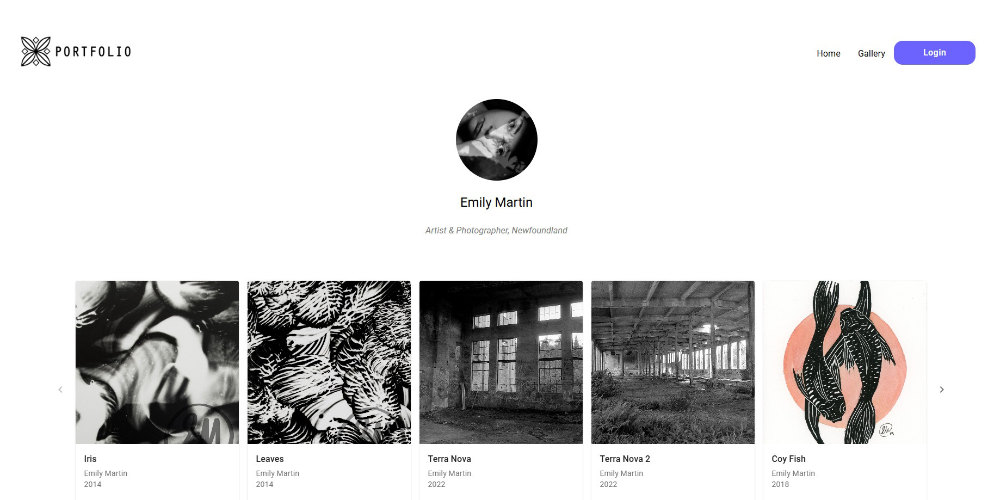
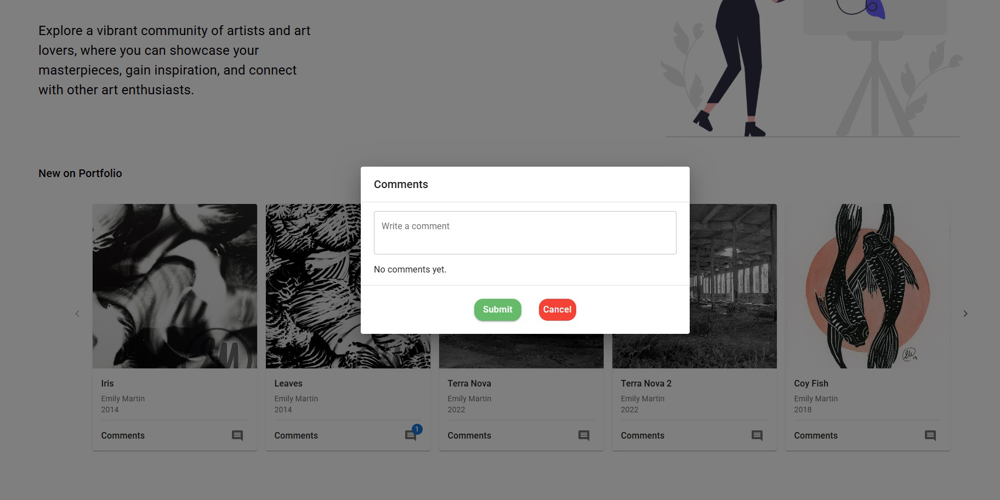

## View Here
https://art-portfolio.fly.dev

## Project Overview
Portfolio is a website I developed to help artists and creators catalog their work while also offering inspiration from other artists. The platform features several key pages:


 
 
Portfolio Page: Users can upload, organize, and manage their own artworks and projects. Artworks can be marked as public or private. Public artworks are displayed on both the user’s profile and homepage , where other users can view and leave comments.
 
 
Gallery Page: Users can browse and favourite artworks from the Art Institute of Chicago, utilizing their open API.


 
 
Accounts Page: Enables users to create and manage personal profiles and accounts.

## Motivation
This project was inspired by my personal need for a platform to catalog my own artworks. I wanted to create a space where I, as well as other creators, could easily document their artworks, search for inspiration and brainstorm ideas all in one unified platform.

## Key Features
Search for inspiration using the Art Institute of Chicago's API.

 
Create a personal account and catalog artworks.
 
Use the project feature to brainstorm and organize art ideas.
 
Explore other artists’ profiles, view their public artworks, and leave comments

## Preview

  
  
  
   
    
     

## Technology Stack
Layout: Figma
 
Frontend: React JS
 
Backend: MySQL
 
Deployment: Fly.io
 
Component Library: MUI
 
API: Art Institute of Chicago

## Credits
Big shoutout to my Get Building coaches, Lucas Hillier and Jack Harrhy. They’ve been an incredible source of support and guidance throughout this project and their thoughtful suggestions were key in turning my ideas into reality. I honestly couldn’t have done it without them, and I’m really grateful for all their help.
